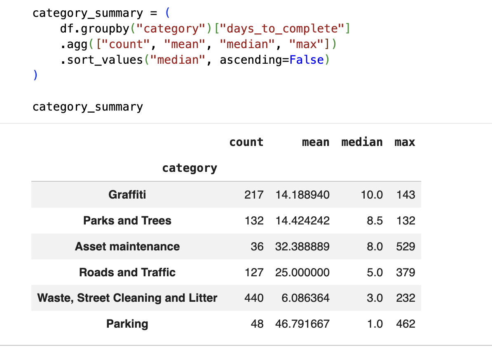
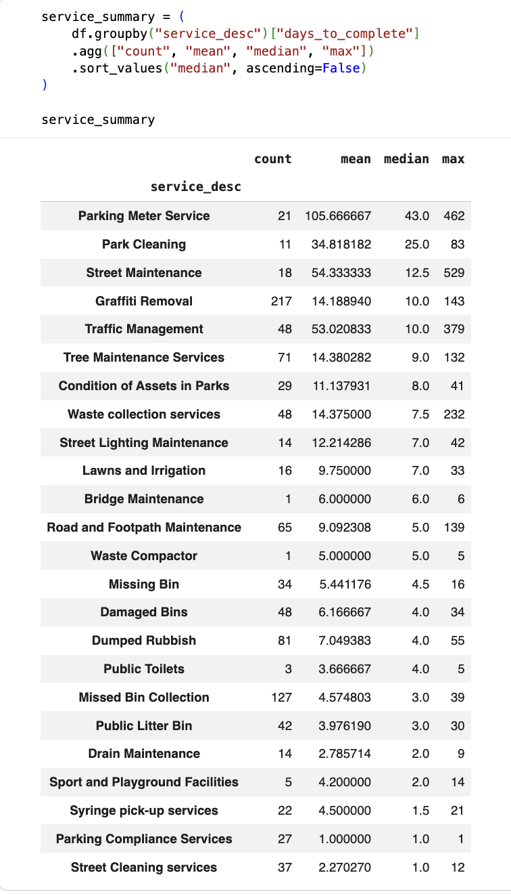
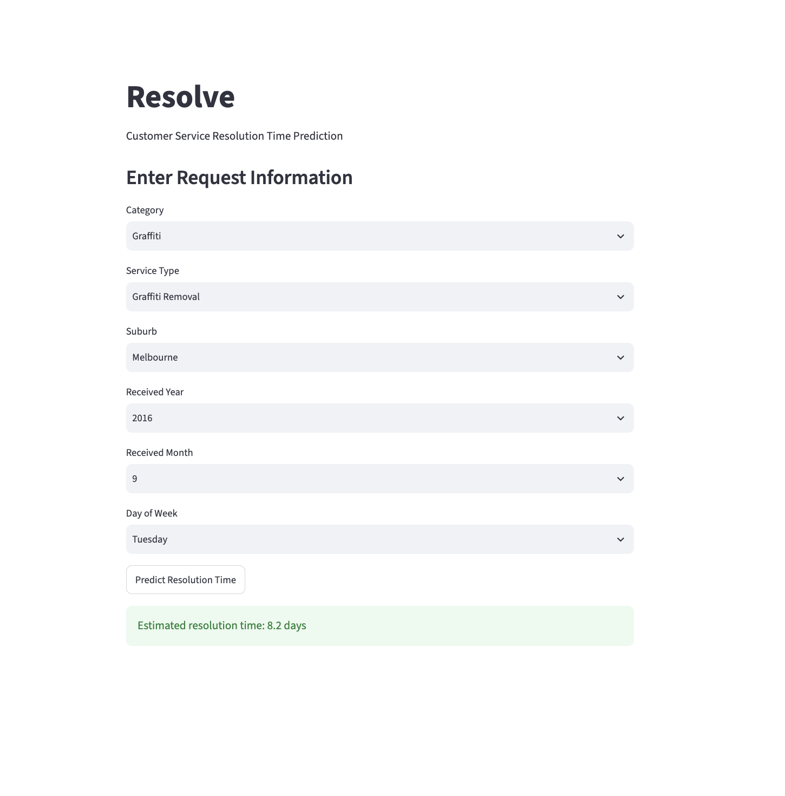

# Resolve – Service Request Resolution Time Prediction

🇹🇷 [Türkçe](#türkçe) | 🇬🇧 [English](#english)

---

# English

## About the Project

Resolve is a machine learning project that predicts how many days a customer service request may take to complete.

The project uses real open data from the City of Melbourne.

I worked on data collection, data analysis, data cleaning, feature engineering, model training, and model evaluation.

I also connected the trained model to a simple Streamlit application.

## Project Goal

The main goal is to answer this question:

> **How many days may this service request take to complete?**

The model uses information such as:

* Service category
* Service type
* Suburb
* Year
* Month
* Day of the week

The `date_completed` column was not used as a feature because it is directly related to the target value.

## Dataset

The dataset comes from the **City of Melbourne Open Data**.

For the first version, 1,000 closed service requests were collected from the API.

The main columns are:

| Column             | Description                                   |
| ------------------ | --------------------------------------------- |
| `request_status`   | Status of the request                         |
| `date_received`    | Date when the request was received            |
| `date_completed`   | Date when the request was completed           |
| `suburb`           | Suburb of the request                         |
| `category`         | Main service category                         |
| `service_desc`     | Type of service                               |
| `days_to_complete` | Number of days needed to complete the request |

Only closed requests were used because they have a completion date.

## Data Analysis

First, I checked the data, missing values, categories, and resolution times.

Some important findings were:

* Most requests were completed in a short time.
* Some requests took much longer.
* Resolution time was not normally distributed.
* Different service types had different median resolution times.
* The `suburb` column had many missing values.

I did not remove the rows with missing suburbs. Instead, missing values were changed to `Unknown` during preprocessing.

### Median Resolution Time by Category



### Median Resolution Time by Service Type



## Machine Learning

I used an 80/20 train-test split.

For categorical features, I used:

* `SimpleImputer`
* `OneHotEncoder`
* `ColumnTransformer`
* `Pipeline`

I tested different models and compared their results.

### Models

* Baseline
* Linear Regression
* Random Forest
* Log-transformed Linear Regression

The best result came from the **Log-transformed Linear Regression** model.

### Results

| Model                 |      MAE |  RMSE |     R² |
| --------------------- | -------: | ----: | -----: |
| Baseline              |    14.50 |     — |      — |
| Linear Regression     |    13.27 | 27.47 |  0.118 |
| Random Forest         |    13.63 | 37.06 | -0.606 |
| Log Linear Regression | **9.62** | 28.44 |  0.054 |

The best model has an MAE of about **9.62 days**.

This means that the predictions are, on average, about 9.6 days away from the real value.

The R² score is still low. This means that the current features cannot explain all the differences in resolution time.

## Prediction Example

For example, the model can receive:

* Category: Graffiti
* Service type: Graffiti Removal
* Suburb: Melbourne
* Year: 2016
* Month: September
* Day: Tuesday

The model predicts a resolution time of about **8.2 days** for this example.

## Streamlit App

I also created a small Streamlit application for making predictions.

The user can enter the request information and get a predicted resolution time.

### Application



## Project Structure

```text
Resolve/
│
├── app.py
├── resolve_analysis.ipynb
├── resolve_model.pkl
├── resolve_dataset.csv
├── requirements.txt
├── .gitignore
├── README.md
│
└── images/
    ├── resolve-streamlit.png
    ├── category-median.png
    └── service-median.png
```

The `.venv` folder is not included in the repository.

## What I Learned

This project helped me practice the basic machine learning workflow from start to finish.

I worked on:

1. Collecting real data from an API
2. Understanding the dataset
3. Checking missing values
4. Exploratory Data Analysis
5. Feature Engineering
6. Train/Test Split
7. Data preprocessing
8. Testing different machine learning models
9. Comparing model results
10. Saving a trained model
11. Using the model in an application

I learned that machine learning is not only about training a model. Data quality, feature selection, model evaluation, and using the model in an application are also important.

## Limitations and Future Work

This is the first version of Resolve.

The current dataset has 1,000 records and the model performance is limited.

For future versions, I want to:

* Collect more data
* Create better features
* Test more machine learning models
* Use cross-validation
* Try hyperparameter tuning
* Improve model evaluation
* Add a FastAPI backend
* Use the model through an API
* Use Docker
* Add tests
* Track different model experiments

The long-term goal is to move Resolve from a simple ML project to a more realistic production-style ML system.

## Technologies

* Python
* Pandas
* NumPy
* Scikit-learn
* Matplotlib
* Jupyter Notebook
* Streamlit
* Joblib
* Git / GitHub

---

# Türkçe

## Proje Hakkında

Resolve, müşteri hizmet taleplerinin tamamlanma süresini tahmin etmeye çalışan bir makine öğrenmesi projesidir.

Projede Melbourne City tarafından yayınlanan gerçek açık veri kullanılmıştır.

Proje boyunca veri toplama, veri analizi, veri temizleme, özellik oluşturma, model eğitimi ve model değerlendirme adımları uygulanmıştır.

Ayrıca eğitilen model, basit bir Streamlit uygulaması ile kullanılabilir hale getirilmiştir.

## Projenin Amacı

Projenin temel amacı şu soruya cevap vermektir:

> **Bir müşteri hizmet talebinin tamamlanması yaklaşık kaç gün sürer?**

Model şu bilgileri kullanır:

* Hizmet kategorisi
* Hizmet türü
* Banliyö / bölge
* Yıl
* Ay
* Haftanın günü

`date_completed` hedef değişken ile doğrudan ilişkili olduğu için modele özellik olarak verilmemiştir.

## Veri Seti

Veri seti **City of Melbourne Open Data** üzerinden alınmıştır.

İlk versiyonda API üzerinden 1.000 adet kapatılmış hizmet talebi toplanmıştır.

Veri setindeki temel sütunlar:

| Sütun              | Açıklama                           |
| ------------------ | ---------------------------------- |
| `request_status`   | Talebin durumu                     |
| `date_received`    | Talebin alındığı tarih             |
| `date_completed`   | Talebin tamamlandığı tarih         |
| `suburb`           | Talebin bulunduğu bölge            |
| `category`         | Ana hizmet kategorisi              |
| `service_desc`     | Hizmet türü                        |
| `days_to_complete` | Tamamlanması için geçen gün sayısı |

Sadece `CLOSED` durumundaki kayıtlar kullanılmıştır. Bunun nedeni bu kayıtların tamamlanma tarihine sahip olmasıdır.

## Veri Analizi

İlk olarak veri setinin yapısı, eksik değerler, kategoriler ve tamamlanma süreleri incelenmiştir.

Önemli bulgular:

* Taleplerin çoğu kısa sürede tamamlanmıştır.
* Bazı taleplerin tamamlanması çok daha uzun sürmüştür.
* Tamamlanma süresi normal bir dağılım göstermemektedir.
* Farklı hizmet türlerinin medyan tamamlanma süreleri birbirinden farklıdır.
* `suburb` sütununda çok sayıda eksik değer bulunmaktadır.

Eksik `suburb` değerleri silinmemiştir. Modelleme sırasında bu değerler `Unknown` olarak doldurulmuştur.

### Kategoriye Göre Medyan Tamamlanma Süresi


### Hizmet Türüne Göre Medyan Tamamlanma Süresi


## Makine Öğrenmesi

Veri %80 eğitim ve %20 test olarak ayrılmıştır.

Kategorik değişkenler için:

* `SimpleImputer`
* `OneHotEncoder`
* `ColumnTransformer`
* `Pipeline`

kullanılmıştır.

Farklı modeller denenmiş ve sonuçları karşılaştırılmıştır.

### Kullanılan Modeller

* Baseline
* Linear Regression
* Random Forest
* Log-transformed Linear Regression

En iyi sonucu **Log-transformed Linear Regression** modeli vermiştir.

### Model Sonuçları

| Model                 |      MAE |  RMSE |     R² |
| --------------------- | -------: | ----: | -----: |
| Baseline              |    14.50 |     — |      — |
| Linear Regression     |    13.27 | 27.47 |  0.118 |
| Random Forest         |    13.63 | 37.06 | -0.606 |
| Log Linear Regression | **9.62** | 28.44 |  0.054 |

En iyi modelin MAE değeri yaklaşık **9.62 gün**dür.

Bu, model tahminlerinin gerçek değerden ortalama olarak yaklaşık 9.6 gün uzak olduğunu gösterir.

R² değerinin düşük olması, mevcut özelliklerin tamamlanma süresindeki farklılıkları yeterince açıklayamadığını göstermektedir.

## Tahmin Örneği

Örnek olarak modele şu bilgiler verilebilir:

* Category: Graffiti
* Service type: Graffiti Removal
* Suburb: Melbourne
* Year: 2016
* Month: September
* Day: Tuesday

Bu örnek için model yaklaşık **8.2 gün** tahmin etmektedir.

## Streamlit Uygulaması

Eğitilen model basit bir Streamlit uygulamasına bağlanmıştır.

Kullanıcı talep bilgilerini girerek tahmini tamamlanma süresini görebilir.

### Uygulama


## Proje Yapısı

```text
Resolve/
│
├── app.py
├── resolve_analysis.ipynb
├── resolve_model.pkl
├── resolve_dataset.csv
├── requirements.txt
├── .gitignore
├── README.md
│
└── images/
    ├── resolve-streamlit.png
    ├── category-median.png
    └── service-median.png
```

`.venv` klasörü GitHub'a eklenmemiştir.

## Bu Projede Neler Öğrendim?

Bu proje ile temel bir makine öğrenmesi projesinin baştan sona nasıl oluşturulduğunu uygulamalı olarak çalıştım.

Öğrendiğim ve uyguladığım başlıca konular:

1. API üzerinden gerçek veri toplama
2. Veri setini inceleme
3. Eksik verileri analiz etme
4. Exploratory Data Analysis (EDA)
5. Feature Engineering
6. Train/Test Split
7. Veri ön işleme
8. Farklı makine öğrenmesi modellerini deneme
9. Model sonuçlarını karşılaştırma
10. Modeli kaydetme
11. Eğitilen modeli bir uygulamada kullanma

Bu proje bana makine öğrenmesinin sadece model eğitmekten oluşmadığını gösterdi. Veri kalitesi, özellik seçimi, model değerlendirmesi ve modelin gerçek bir uygulamada kullanılması da önemli.

## Sınırlamalar ve Gelecek Çalışmalar

Bu proje Resolve'un ilk versiyonudur.

Mevcut veri seti 1.000 kayıttan oluşmaktadır ve model performansı sınırlıdır.

Gelecek versiyonlarda:

* Daha fazla veri toplamak
* Daha iyi özellikler oluşturmak
* Daha fazla model denemek
* Cross-validation kullanmak
* Hyperparameter tuning yapmak
* Model değerlendirmesini geliştirmek
* FastAPI backend eklemek
* Modeli API üzerinden kullanmak
* Docker kullanmak
* Testler eklemek
* Farklı model deneylerini takip etmek

istiyorum.

Uzun vadede amaç, Resolve'u basit bir ML projesinden daha gerçekçi ve production-style bir ML sistemine dönüştürmektir.

## Kullanılan Teknolojiler

* Python
* Pandas
* NumPy
* Scikit-learn
* Matplotlib
* Jupyter Notebook
* Streamlit
* Joblib
* Git / GitHub

---
